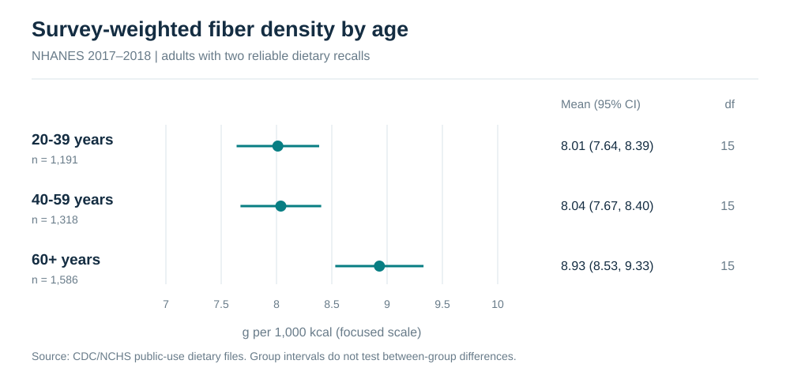

# NHANES Nutrition Survey Analysis

[](https://github.com/mjeans/nhanes-nutrition-survey-analysis/actions/workflows/validate.yml)

A reproducible nutritional-epidemiology analysis of public-use NHANES 2017–2018 data. The project estimates two-day fiber and sodium density among U.S. adults while accounting for dietary sample weights, masked strata, and primary sampling units.

> This is a portfolio analysis of deidentified public-use data, not clinical guidance. Estimates describe population dietary intake and do not identify causes or individual health needs.

## Why this project

Nutrition analyses built from national surveys require more than downloading a spreadsheet. This repository makes the analytic decisions visible:

- two 24-hour recalls are averaged before energy adjustment;
- the NHANES two-day dietary weight (`WTDR2D`) defines the represented population;
- Taylor linearization accounts for stratification and clustering;
- subgroup estimates are calculated as domains rather than treating each subgroup as a simple random sample;
- missingness and cohort exclusions are reported explicitly;
- survey-weighted regression is presented as descriptive adjustment, not causal evidence.

## Research questions

1. What are survey-weighted mean fiber and sodium densities among U.S. adults?
2. How do these descriptive estimates vary across age and sex domains?
3. Are age, sex, and family income-to-poverty ratio associated with nutrient density after mutual adjustment?

## Results at a glance



The complete generated findings are in [the analysis summary](outputs/summary.md), with machine-readable [domain estimates](outputs/nutrient_density_by_group.csv), [regression estimates](outputs/regression_coefficients.csv), and [cohort flow](outputs/analytic_cohort_flow.csv).

## Repository map

```text
.
├── .github/workflows/   Automated validation
├── assets/              Deterministically generated figure
├── data/                Data provenance and governance notes
├── docs/                Estimands, design, and limitations
├── outputs/             Reproducible results
├── scripts/             CDC download, cohort construction, and analysis
├── src/                 Inspectable survey-statistics functions
└── tests/               Unit and regression tests
```

## Reproduce the analysis

Python 3.12 is recommended.

```bash
python -m pip install -r requirements.txt
python tests/test_survey_methods.py
python scripts/run_analysis.py
```

The analysis downloads three static CDC/NCHS XPT files into `data/raw/`, which is excluded from version control:

- [Demographic variables and sample design](https://wwwn.cdc.gov/nchs/data/nhanes/public/2017/datafiles/DEMO_J.htm)
- [Day 1 total nutrient intakes](https://wwwn.cdc.gov/nchs/data/nhanes/public/2017/datafiles/DR1TOT_J.htm)
- [Day 2 total nutrient intakes](https://wwwn.cdc.gov/nchs/data/nhanes/public/2017/datafiles/DR2TOT_J.htm)

## Interpretation boundaries

Two 24-hour recalls improve on a single recall but do not identify each participant's long-term usual intake. The public data suppress some design information, dietary recalls are subject to day-to-day variation and measurement error, complete-case regression can remain sensitive to missingness, and cross-sectional associations are not causal effects. See [Methods and limitations](docs/methods.md).

## Citation

Citation metadata are available in [`CITATION.cff`](CITATION.cff). The underlying NHANES files remain governed and cited by CDC/NCHS.
