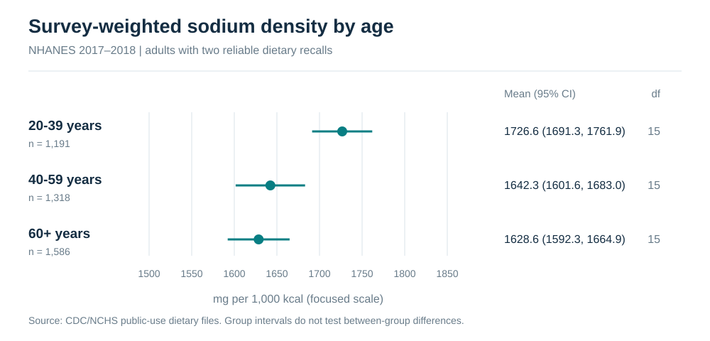
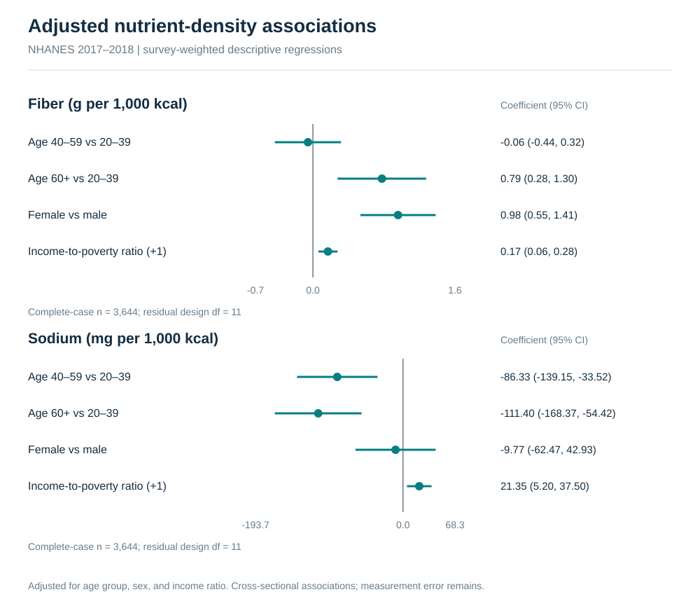

# Executed nutritional-epidemiology report

## Question and population

How do two-day fiber and sodium densities vary by age, sex, and family income-to-poverty ratio? This analysis uses public-use NHANES 2017–2018 adults aged 20+, excludes those identified as pregnant, and requires two reliable recalls and positive WTDR2D weights. It is a cross-sectional portfolio analysis, not clinical guidance.

## Cohort flow

| stage | participants |
| --- | --- |
| Merged demographic participants | 9254 |
| Positive two-day dietary weight | 7641 |
| Two reliable dietary recalls | 6491 |
| Age 20 years or older | 4139 |
| Not identified as pregnant | 4095 |
| Complete energy, fiber, and sodium | 4095 |
| Complete income-to-poverty ratio for regression | 3644 |

## Descriptive estimates

Weighted ratio means; Taylor-linearized SEs; t-based 95% intervals using domain design degrees of freedom. Sample counts are unweighted.

| group | measure | estimate | lower_95 | upper_95 | unweighted_n | design_df |
| --- | --- | --- | --- | --- | --- | --- |
| All adults | Fiber (g per 1,000 kcal) | 8.292 | 8.014 | 8.570 | 4095 | 15 |
| All adults | Sodium (mg per 1,000 kcal) | 1668.230 | 1643.989 | 1692.472 | 4095 | 15 |
| Male | Fiber (g per 1,000 kcal) | 7.765 | 7.426 | 8.103 | 1977 | 15 |
| Male | Sodium (mg per 1,000 kcal) | 1682.569 | 1649.797 | 1715.340 | 1977 | 15 |
| Female | Fiber (g per 1,000 kcal) | 8.784 | 8.461 | 9.107 | 2118 | 15 |
| Female | Sodium (mg per 1,000 kcal) | 1654.864 | 1619.532 | 1690.197 | 2118 | 15 |
| 20-39 | Fiber (g per 1,000 kcal) | 8.012 | 7.639 | 8.386 | 1191 | 15 |
| 20-39 | Sodium (mg per 1,000 kcal) | 1726.630 | 1691.312 | 1761.948 | 1191 | 15 |
| 40-59 | Fiber (g per 1,000 kcal) | 8.039 | 7.674 | 8.404 | 1318 | 15 |
| 40-59 | Sodium (mg per 1,000 kcal) | 1642.327 | 1601.608 | 1683.046 | 1318 | 15 |
| 60+ | Fiber (g per 1,000 kcal) | 8.931 | 8.532 | 9.329 | 1586 | 15 |
| 60+ | Sodium (mg per 1,000 kcal) | 1628.584 | 1592.271 | 1664.897 | 1586 | 15 |

## Adjusted associations

[All coefficients, sample counts, and regression residual df](regression_coefficients.csv). These are descriptive associations, not causal effects. Group-interval overlap is not a test of a between-group contrast.

## Income nonresponse: observed-data comparison

| group | outcome | estimate | lower_95 | upper_95 | unweighted_n | design_df |
| --- | --- | --- | --- | --- | --- | --- |
| All eligible adults | fiber_g_per_1000_kcal | 8.292 | 8.014 | 8.570 | 4095 | 15 |
| All eligible adults | sodium_mg_per_1000_kcal | 1668.230 | 1643.989 | 1692.472 | 4095 | 15 |
| Income observed | fiber_g_per_1000_kcal | 8.255 | 7.992 | 8.519 | 3644 | 15 |
| Income observed | sodium_mg_per_1000_kcal | 1668.542 | 1641.620 | 1695.464 | 3644 | 15 |
| Income missing | fiber_g_per_1000_kcal | 8.681 | 8.006 | 9.356 | 451 | 15 |
| Income missing | sodium_mg_per_1000_kcal | 1664.948 | 1596.850 | 1733.046 | 451 | 15 |

Comparing measured outcomes in income responders and nonresponders exposes selection but cannot establish why income is missing or remove bias.

## Missing-income assumption stress test

| scenario | outcome | income_coefficient | unweighted_n |
| --- | --- | --- | --- |
| Missing income: cell median -1 | Fiber (g per 1,000 kcal) | 0.133 | 4095 |
| Missing income: cell median -1 | Sodium (mg per 1,000 kcal) | 19.020 | 4095 |
| Missing income: cell median +0 | Fiber (g per 1,000 kcal) | 0.158 | 4095 |
| Missing income: cell median +0 | Sodium (mg per 1,000 kcal) | 20.647 | 4095 |
| Missing income: cell median +1 | Fiber (g per 1,000 kcal) | 0.175 | 4095 |
| Missing income: cell median +1 | Sodium (mg per 1,000 kcal) | 21.099 | 4095 |

For missing income, each scenario assigns the unweighted observed median within age-by-sex cells, then shifts it by -1, 0, or +1 ratio unit and clips to the released 0–5 range. All original eligible adults enter these scenario regressions. The complete-case estimate remains primary. These are deliberately coarse, post-audit sensitivity scenarios, not prespecified substantive hypotheses, multiple imputation, or proof of robustness to all missing-not-at-random mechanisms. Only coefficient estimates are shown: ordinary model SEs would ignore imputation uncertainty and should not be interpreted as valid inferential intervals here.

## Verification and limitations

Means, SEs, and regression covariance are checked against R survey 4.5 on a committed fixture, including sparse domains and missing predictors. Single-PSU strata and singular designs fail explicitly; zero inferential df yields no interval. [Methods and benchmark protocol](../docs/methods.md).

Two recalls do not recover usual intake. Recall error, residual confounding, influential weights, and nonresponse remain. The audit did not fit a usual-intake model or a missingness model, and this single-cycle analysis is not a definitive population study.

## Reproduction

Run `python scripts/run_analysis.py` after installing `requirements.txt`. Only aggregate outputs are committed. [Source URLs and SHA-256 checksums](../data/source-manifest.json) are verified before analysis.

Executed with Python 3.12, NumPy 2.5.2, pandas 3.0.5, SciPy 1.17.1.
